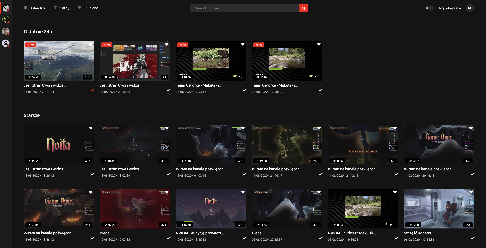

# Jarchiwum - NextJS

## [Check live version](https://jarchiwum.pl/) 

The app allows users to subscribe their favorite twitch streamers, and watch streams that they have missed.  

App simply starts with just demo state of default channels that community of jadisco.pl watch. User then can simply add their own channels and/or remove them. Mark videos as watched and bookmarked. 

By default state will be stored in browser localStorage, but you can register simple user account so your data will be stored in firebase for syncing state between browsers you use. 

If you are a streamer yo can share link like:  https://jarchiwum.pl/your-twitch-name and that will automatically  add your channel to users favorites. 

*Important note:* chat on some video page is made by [tr0lit](https://tr0l.it/) [poorchat](https://www.poorchat.net/)

## Tech stack

### Frontend

* [NextJS](https://nextjs.org/) 
* [Redux](https://redux.js.org/) 
* [TypeScript](https://sass-lang.com/)

### API

* [NodeJS](https://nodejs.org/en/) 
* [MongoDB](https://www.mongodb.com/) 
* [Elasticsearch](https://www.elastic.co/) 

## Installation
You can just clone repository files and run to install all dependencies:

`npm install`

After that just run to start server:

`npm run dev`

To build project:

`npm run build`

*All project files are located in ./src/*